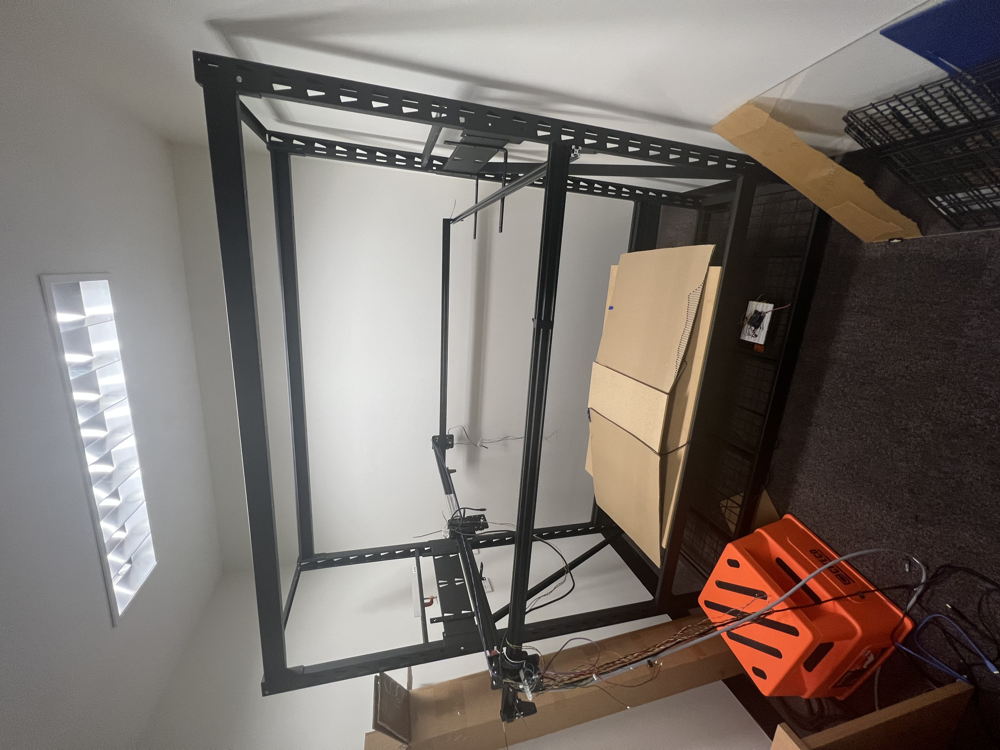

## Hey! Is this thing on?
### Space-based object detection optimisation with neuromorphic cameras

This experiment aimed to track the effects manipulating a neuromorphic camera's biases had on object detection in an adverse lighting simulation replicating a star cluster in the night sky.
The set-up placed a neuromorphic camera on a GRBL-controlled carriage driven by stepper motors, which was then programmed to sweep over a simulated star field in a "Darkroom."

<p align="center">
  
</p>

The starfield consisted of fibre optic strands to replicate stars. To add variance in sizes and illumination of the "stars", different-sized holes were drilled into a plywood board. The hole configurations with corresponding stands were:
| Hole Size | Strands |
|----------|----------|
| 0.7mm    |     1    |
| 0.9mm    |     2    |
| 1.0mm    |     3    |
| 1.3mm    |     4    |
| 1.5mm    |     5    |
| 2.0mm    |     6    |
| 2.2mm    |     7    |
| 3.2mm    |     8    |
| 3.75mm   |     9    |

<p align="center">
  
</p>

<p align="center">
  
</p>

A piece of 13mm thick plywood supported the strands as they were fed into the holes. This support held the fibres perpendicular to the top face of the board and parallel with the lens on the camera.

### Prototye code
The prototype file located in the "Old Work V1" folder was used for initial testing. This file required an operator to sit in the room, manually increase/decrease bias settings, start/stop recordings, and send GRBL commands. These manual operations were not efficient or consistent, as the lighting from the computer monitor constantly altered the illumination levels in the room. This change caused irregularities in the recordings. Though as a proof of concept, the design operated as desired with minimal/no effect from the stepper motors during operation seen in the camera. The code for the prototye was built on the PSEE413 platform and used threads to monitor and accept input changes. In the example below while the connection to the camera was live the "6" button could be pressed and providing the th_off bias was greater than 1 it would be reduced. 
```py
    if c == ord("6") and th_off > 1:
            th_off -= 1
            camera.set_parameters(
                psee413.Parameters(
                    biases = psee413.Biases(
                        diff_on = th_on,
                        diff = diff,
                        diff_off = th_off,
                    )
                )
            )
```
This code did evolve to incorpirate some automation which allowed by pushing the "g" button the system would start recording, move, finish recording after the count condition was met and reset. Each time the "g" button was pressed the bias would also shift by 1 as seen below.
```py
    if c == ord("g"):
            #ser.write(("G00 X10Y10" + "\n").encode()) 
            th_off += 1
            name = f'{datetime.datetime.now(tz=datetime.timezone.utc).isoformat().replace("+00:00", "Z"+ str(th_off) + "OFF" + str(th_on)+"ON").replace(":", "-")}.es'
            camera.start_recording_to(name)
            recording = True
            print("Recording to " + name)
            time.sleep(0.5)
            with open('C:\\Users\\Josh.F\\Desktop\\19317377\\PG\\Frame design\\Python\\startest.gcode', 'r') as f:
                for line in f:
                    print('Sending: ' + line)
                    ser.write((line + "\n").encode())  # Send g-code block to grbl
                    time.sleep(0.1)
    
            count = 0
```

### V2 Code
Moving forward it was important to incorpirate a full automation process and improved efficency. To achieve this the new code incorpirated a state machine. the state machine allowed the program to constantly run looking only for changes in variable flags that would be set/reset depending on what stage the process the system was in.

Communication via the camera was now done via the neuromorphic_drivers module (https://github.com/neuromorphicsystems/neuromorphic-rs) which when recording packets from the camera would be stored in an array then written to a csv file while at the same time the sytem was returning to its home location ready for another recording. 

The code is programmed to do a single bias recording at a time (diff_off or diff_on) and starting at the greatest threshold for both (255) the bias of interest is reduced by 1 each pass untill either the bias reached 1 or a timeout error would occur. The timeout error is caused by excess data too large for the usb to transfer. This error would always flag as the biases approached 1 as each bias reducion would result in pixels becoming more and more sensitive often causing hot pixels. 

The code below shows a snippet of the state machine where the script will just continue to roll over the if statements waiting for the the corresponding flag to be raised. For instance during the recording phase the flag recording will be equal to 1. Therefore each time the script runs over "if recording == 1:" the packets are then loaded into the array "packetdata". The point of this code is for the machine to not have heavy operations to carry out. Instead multiple easy tasks are provided. 

```py
    if recording == 1:
        if 'dvs_events' in packet:
            packetdata.extend(packet['dvs_events'])
        
    if save == 1:
        fname = f"off_{configuration.biases.diff_off}_on_{configuration.biases.diff_on}"
        reclist[fname] = packetdata

        configuration.biases.diff_on -= 1 
        device.update_configuration(configuration)
        print(configuration.biases.diff_on)
        save = 0

    if checkI in pos and moving == 1:
        with open('C:\\Users\\Josh.F\\Desktop\\19317377\
                  \\PG\\WorkingFolderV2\\gcode\\c800.gcode', 'r') as f:
            for line in f:
                print('Sending: ' + line)
                ser.write((line + "\n").encode())  
                time.sleep(0.5)
        
        recording = 0
        move800 = 1
        move200 = 0
        moving = 0
        save = 1
```


Below the file sizes relative to bias can be seen. 

### Diff_off File size (MB) vs Bias
<p align="center">
  
</p>
<p align="center">
  
</p>

### Diff_on File size (MB) vs Bias
<p align="center">
  
</p>
<p align="center">
  
</p>

### Plot Discussion Points
- In both plots the first file size is quite large compared to the subsequent files. This is due to the pixels still leveling out after ambient light being let     into the room with the door being open and closed by the operator.
- In Diff_off the file size interestingly continues to decresases to a bias of 136 before it begins to increase again.
- When diff_off bias reaches 55 the sharp spike is caused by a single hot pixel. These hot pixels continue to grow in the remianing files.
- The diff_on file size depicts what would be expected as the threshold is reduced each run. The file size can be seen to be growing constantly until the bias      reaches 58 at which point file size starts to grow exponetioaly.
The plots above offer some intersting insights into how the bias effect file size. Under these conditions diff_off has an interesting occurance where less data is generated than at 255 which should be the largest threshold. Aditionally the hot pixel scenario comes in with immediate effect with no warning. Diff_on on the other hand has a nice linear data growth until 58 where the data size become more exponential, interestingly the hot pixel started at 70.

### Current working files
In an effert to further impove efficency the v2 code was modified to to save data straight from the camera in a RAW format. This allowed an additional 4 recordings prior to the timeout error. The benifit of this code is that it further simplified the script reducing the lines of code by approximatly 30. The script during the recording phase seen below is now simply writes the packet data straight to the RAW file then when recording is done closes the output. A new file is then generated and data can be written again. This has removed the need to fill an array, then convert the array to csv.

```py
    if recording == 1:                              # If recording is set
    output.write(packet)                        # Write packet data to current open output file
```


### Dataset

.ES and csv files are avaliable using the link below. There are files for both Diff_On and Diff_Off in raw form and also as a zipped file.

https://westernsydneyedu.sharepoint.com/:f:/r/sites/MoNE2022/Shared%20Documents/General/SimulatedStarRecordings?csf=1&web=1&e=SZCRum
