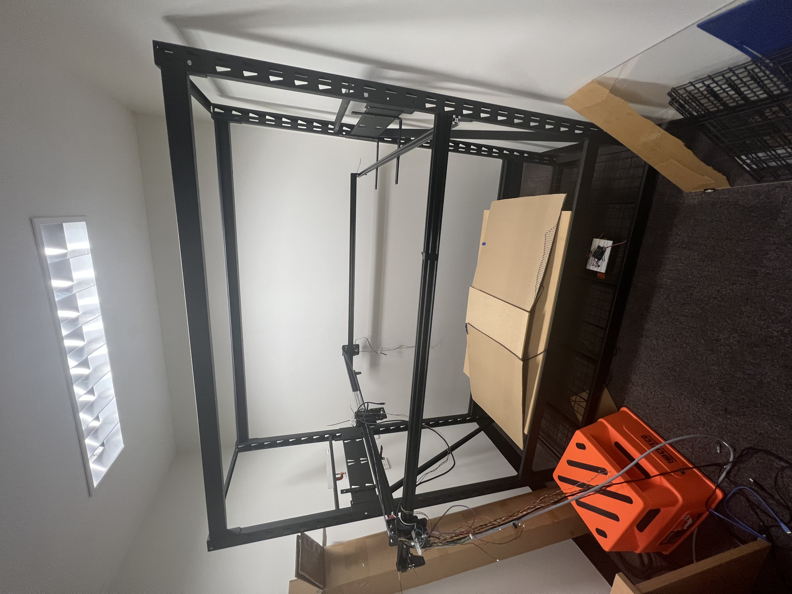
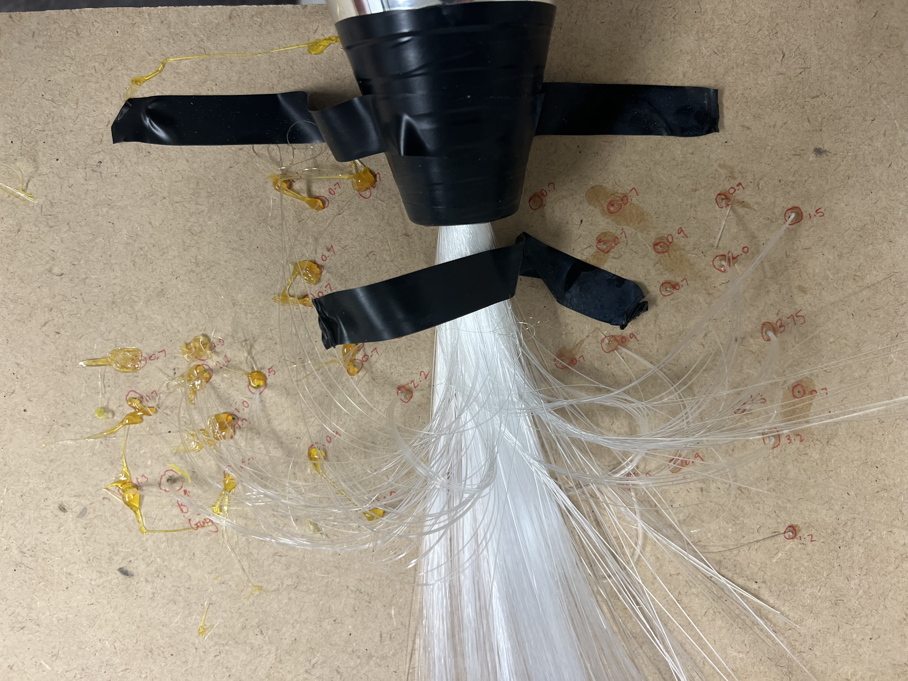
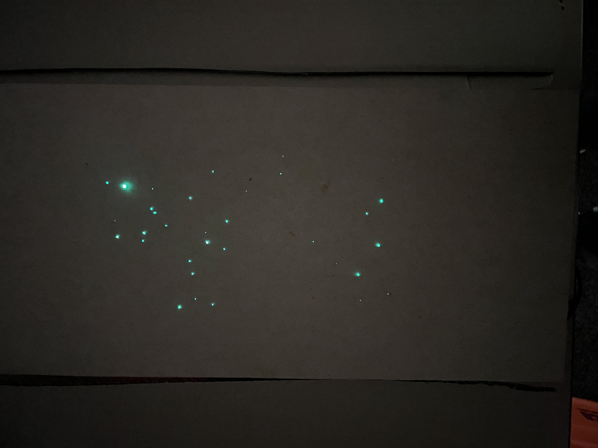

## Hey! Is this thing on?
### Space based object detection optimisation with neuromorphic cameras

This experiment aimed to track the effects of manipulating a neuromorphic camera's biases on object detection in an adverse lighting simulation replicating a star cluster in the night sky.
The set-up placed a neuromorphic camera on a GRBL-controlled carriage driven by stepper motors, which was then programmed to sweep over a simulated star field in a "Darkroom."

  

The starfield consisted of fibre optic strands to replicate stars. To add variance in sizes and illumination of the "stars", different-sized holes were drilled into a plywood board. The hole configurations with corresponding stands were:
| Hole Size | Strands |
|----------|----------|
| 0.7mm    |     1    |
| 0.9mm    |     2    |
| 1.0mm    |     3    |
| 1.3mm    |     4    |
| 1.5mm    |     5    |
| 2.0mm    |     6    |
| 2.2mm    |     7    |
| 3.2mm    |     8    |
| 3.75mm   |     9    |

  

  

Thick 13mm plywood was used to provide a support for the strands as they were fed into the holes. This support held the fibres perpendiular to the top face of the board and parrellel with the lens on the camera.

### Dataset

.ES and csv files are avaliable using the link below. There are files for both Diff_On and Diff_Off in raw form and also as a zipped file.

https://westernsydneyedu.sharepoint.com/:f:/r/sites/MoNE2022/Shared%20Documents/General/SimulatedStarRecordings?csf=1&web=1&e=SZCRum
