# Are you seeing this? Space-based object detection optimisation with neuromorphic cameras 

## Design, Hardware and Control
This experiment aims to track the effects manipulating a neuromorphic camera's biases has on object detection. The concept was to have a neuromorphic camera move across a replicated star cluster or vice versa in a controlled low-light environment. The initial proposal for this design had a fixed camera mounted in the centre of two rings, as seen below in Figure 1 (Left). The concept's inner ring would have a star pattern drilled into it. Two light sources are mounted between the first and second rings. They are orientated to illuminate the area between the rings in line with the camera. Driving the inner ring would create illumination changes across the camera's sensor. Due to the complexity of recreating an accurate star map on the curved surface and the limitation of the room inside the inner ring, this design was inadequate.

A redesign of the original concept led to the final design. The design allowed for versatility in mounting options and adjustable heights. These improvements also allowed the star map to be projected from a flat surface, making recreation much more straightforward.


<p align="center">
  
  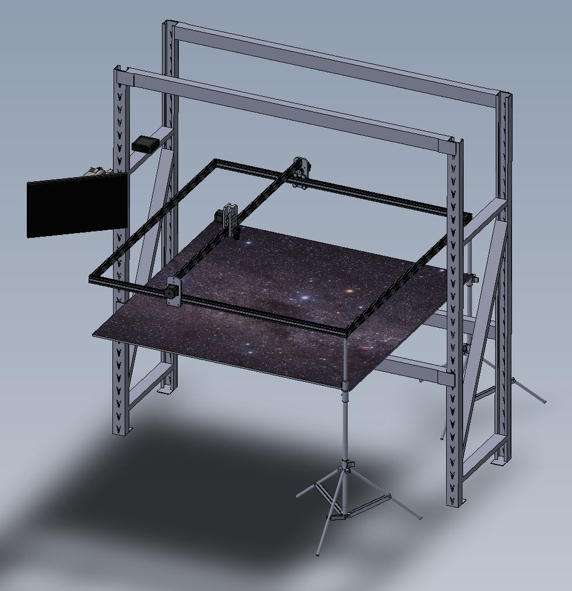
</p>


One of the techniques taught in the neuromorphic sensing unit was lens selection and Field of View (FOV). Below is a table covering three lenses at three different rudimentary distances from the star map. As the camera would be passing over the "stars" in the y direction, it was necessary to tune the physical dimensions to this. Ideally, the single stand light should show as a single pixel. With this assumption, using the stand thickness of 0.4mm, a desired FOV in the y direction is calculated by multiplying 0.4 by 720 (sensor pixel height), returning 288mm. The distance between the lens and lights could not be tuned to achieve a measurement as close to this. The actual FOV achieved on the y-axis using a 12mm lens was 259mm due to the constraints in the fixed point height adjustments.

| Lens | Distance(mm) | Height(mm) | Width(mm) |
|------|--------------|------------|-----------|
| 8mm  |     500      |    267     |    356    |
| 8mm  |     1000     |    534     |    712    |
| 8mm  |     1500     |    801     |    1068   |
| 10mm |     500      |    213     |    285    |
| 10mm |     1000     |    427     |    570    |
| 10mm |     1500     |    641     |    855    |
| 12mm |     500      |    178     |    237    |
| 12mm |     1000     |    356     |    475    |
| 12mm |     1500     |    534     |    712    |

The driving hardware selected for this project is an ACRO 1500mm x 1500mm CNC Kit (https://www.makerstore.com.au/product/kit-acro-1515-s/) and an Arduino CNC shield with DRV8825 High Current Drivers. Within the python recorder.py script, G-code is sent to the CNC steppers via GRBL. These commands could be sent as a single line in code or called a multi-line g-code file.

Below is an example of a single-line instruction. In this example, the carriage is sent the command over serial using ser. write to move from its current position to using G01, a linear (straight line movement), at a feed rate (Speed) of F3000 mm/min to location X200. No Y position is included in this command, so the current Y value is held.

```py
    ser.write(("G01 F3000 X200" +"\n").encode())# Send single line command to GRBL to move camera to X200  
```
In order to send a multi-line g-code file over GRBL, the file needs to be opened and read line by line. While running each line, the command is sent using the same ser.write as the example above. A brief wait of 100ms occurs between each line, allowing the Arduino to process and send the command. Below is the code from recorder.py, which runs the homing cycle for the CNC.
```py
# Open homing gcode file as a read only file and assign it to variable f
with open('WorkingFolderV3\gcode\homing.gcode', 'r') as f:
    for line in f:                          # Read each line consecutively from gcode file
        print('Sending: ' + line)           # Print in terminal line sent
        ser.write((line + "\n").encode())   # Send line information to GRBL to excute
        time.sleep(0.1)                     # Wait 100ms to send next line 
```
Below is the homing. gcode file called above. 4 commands are saved, which prepare the CNC once the script is first run. These commands reset the limits and positioning of the carriage and set it to its "Ready" state.
```
$H            % Start homing cycle
G92 X0 Y0     % Set work-coordinate offset
G90           % Absolute values
G00 X750Y700  % move to starting location
```
  
The image below shows preliminary testing on the frame.

<p align="center">
  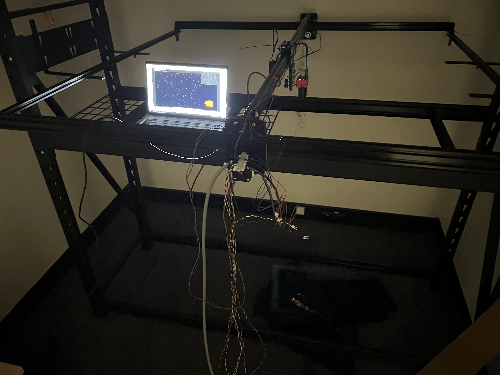
</p>

## Star Field
The star field for this concept is based on previously captured ground truth data of the star Mu Velorum and its surroundings. The reconstructed starfield consists of fibre optic strands inserted into plywood to replicate the same star pattern. In order to add variance in sizes and illumination of the "stars" to better match the example, different-sized holes were drilled into the plywood board. These holes allowed multiple strands to be inserted, giving the impression of larger/brighter stars. During this step, it was necessary to replicate the ground truth as closely as possible to ensure the best chance of optimal optimisation. 

The hole configurations with corresponding stands are outlined in the table below:

| Hole Size | Strands |
|----------|----------|
| 0.7mm    |     1    |
| 0.9mm    |     2    |
| 1.0mm    |     3    |
| 1.3mm    |     4    |
| 1.5mm    |     5    |
| 2.0mm    |     6    |
| 2.2mm    |     7    |
| 3.2mm    |     8    |
| 3.75mm   |     9    |

A piece of 13mm thick plywood supported the strands as they were fed into the holes. This support held the fibres perpendicular to the top face of the board, holding the lighting surface parallel to the lens on the camera, reducing visual errors. The following images show the underside and top of the plywood housing the optic strands. The ply's underside on the left shows the holes' distribution sizing and strand placement. The right shows the final "Star" layout used in the experiments. 

<figure>
  <p align="center">
    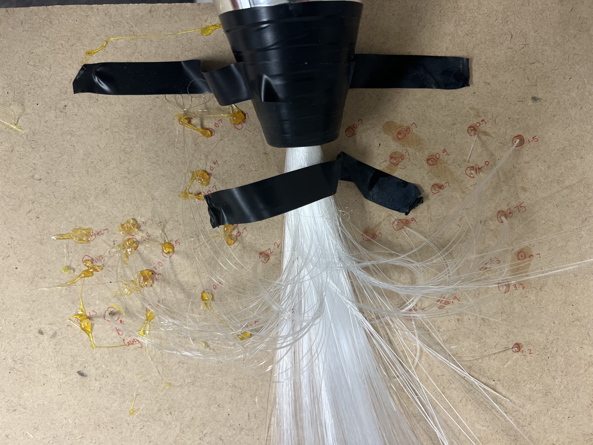
    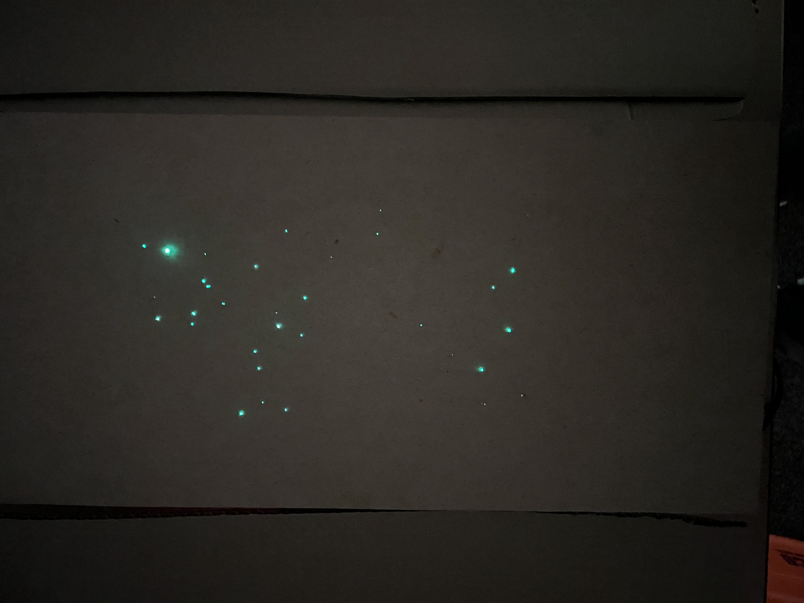
  </p>
  <figcaption align="center">Figure 1: Left: Underside of plywood, strand distribution. Right: Final "Star" result.</figcaption>
</figure>

In order to test the accuracy of the replication compared to the ground truth, both images were run through astrometry.net (https://nova.astrometry.net/). This website takes an uploaded image and locates its origin in the sky. As expected, the ground truth image was positioned in the origin location in the sky. The replication search time was longer when processing, but it was located and copied to the original location. Side by side, these images can be told apart from the replication, which lacks the environmental noise that the original has. The following three images show the origin with the authentic and fake overlays and one of the origins by itself.

<p align="center">
  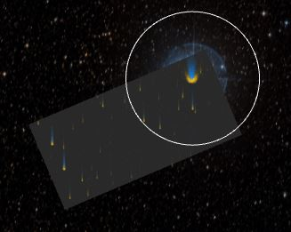
  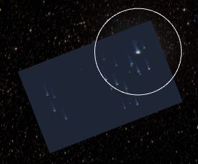
</p>


<p align="center">
  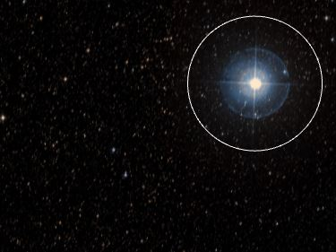
</p>


## Camera
The camera used for recordings was a Prophesee EVK4. The EVK4 is a neuromorphic camera with a Sony IMX636 HD (720x1280 pixel) sensor. Neuromorphic cameras are unique in how they record data. They detect illumination changes asynchronously at a pixel level and return an "event" with a polarity of either 0 or 1. These polarities tell if the pixel had an off event (0), which occurs when light across the pixel is reduced or an on event (1), which is an increase of light across the pixel. 

In a neuromorphic camera, each pixel has a stored log intensity (Image below left as ln(i)), a current baseline value for illumination. The baseline resets as the log intensity reaches the set threshold depicted as the dotted line in the image below on the right (upper diagram). This baseline is then used by the comparators (ON and OFF) to compare itself against their threshold values. These thresholds are user-defined by the diff_on and diff_off Bias, where larger values in these biases would require more significant light variance across the pixel before breaching the threshold and registering an event. The greater the bias value (255 max), the less sensitive (detail) the pixel, resulting in fewer events. As sensitivity is increased, data size and rate follow. This experiment aims to find this "happy medium" between sensitivity and data rate. 

<p align="center">
  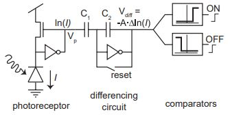
  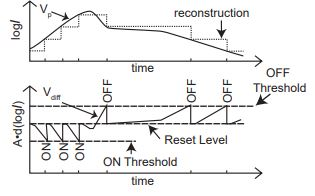
</p>

<p align="center"><i>Lichtsteiner, P, Posch, C & Delbruck, T 2008, 'A 128 x 128 120 dB 15 us Latency Asynchronous Temporal Contrast Vision Sensor', IEEE Journal of Solid-State Circuits, vol. 43, no. 2, pp. 566–576.</i></p>


## Coding
### V1 Code
The prototype file in the "Old Work V1" folder was used for initial testing. This file required an operator to sit in the room, manually increase/decrease bias settings, start/stop recordings, and send GRBL commands. This manual operation was not efficient or consistent. The lighting from the backlit buttons as they were pushed and the computer's monitor constantly altered the room's illumination levels, causing irregular recordings. Though as a proof of concept, the design operated as desired with minimal/no effect from the stepper motors during operation seen in the camera presenting as vibrations, causing the pixels to oscillate on and off constantly. 

The code for the prototype was built on the PSEE413 platform and used threads to monitor for inputs from the operator. One of these inputs is seen in the example below. This code was available when the camera was in a real-time live-view state. If no other instructions were running during this time, pressing the "6" button would execute the commands provided th_off was greater than 1. The commands would reduce th_off by one and then set the updated diff_off value by accessing the bias parameters in PSEE413. 
```py
if c == ord("6") and th_off > 1:          # "Look" for an input command from the 6 button and confirm th_off is greater than 1 
        th_off -= 1                       # Reduce th_off by 1
        camera.set_parameters(            # Set the camera parameters to:
            psee413.Parameters(           #     - access from psee413 parameters and biases of the of the camera 
                biases = psee413.Biases( 
                    diff_on = th_on,      #     - refresh changes in biases 
                    diff = diff,
                    diff_off = th_off,
                )
            )
        )
```

Following the proof of concept, an attempt was made to incorporate some automation into this script. This automation allowed an operator to push the "g" button. The system would increase th_off by 1, create and name a .es file, start recording data and run the G-code command from the CNC controller via GRBL. 

```py
  if c == ord("g"):                              # "Look" for an input command from the g button
    #ser.write(("G00 X10Y10" + "\n").encode())   # This line was commented out as the move instruction was repositioned during the automation process 
    th_off += 1                                  # increase th_off by 1
    name = f'{datetime.datetime.now(tz=datetime.timezone.utc).isoformat().replace("+00:00", "Z"+ str(th_off) + "OFF" + str(th_on)+"ON").replace(":", "-")}.es'          # create es file name
    camera.start_recording_to(name)              # start recording data to the es file 
    recording = True                             # set recording flag
    print("Recording to " + name)                # print to terminal "recording to "name""
    time.sleep(0.5)                              # wait es file to be created/formatted
    with open('C:\\Users\\Josh.F\\Desktop\\19317377\\PG\\Frame design\\Python\\startest.gcode', 'r') as f: # Open startest gcode file as a read only file and assign it to variable f
    for line in f:                               # Read each line consecutively from gcode file
        print('Sending: ' + line)                # Print in terminal line sent
        ser.write((line + "\n").encode())        # Send line information to GRBL to excute
        time.sleep(0.1)                          # Wait 100ms to send next line 
    
    count = 0                                    # reset counter to 0
```
This semi-automated process still had ongoing flaws requiring human interaction at each iteration and the negative impacts from the illumination noise caused by the keyboard and monitor. This testing also outlined an efficiency issue with the code. The code would often become interlocked between 2 steps or run instructions out of order. Processing the recording was also cumbersome on the script and would often cause premature timeout errors on large thresholds. The problem with timeout errors is that the camera would need resetting. This reset would also reset the saved log intensity value conditioned to the room. From testing, the first 1-2 recordings post rest would have additional noise as pixels returned to a normalised state. 

### V2 Code
Moving forward, it was essential to incorporate an entire automation process, improve efficiency in recording consistency, and reduce the time to complete a full data set (from 255 > 0). To achieve this, a new code was developed using a state machine's design, which also operates asynchronously. The state machine allowed the program to constantly run, looking only for Boolean changes in variable flags that would be 1 or 0, depending on the stage of the system's process. 

Communication via the camera was now done via the neuromorphic_drivers module (https://github.com/neuromorphicsystems/neuromorphic-rs), which, when recording packets from the camera, would be stored in an array with each column allocated to a different bias reading. Each array column would be written to a unique CSV file when the script finished (met the final condition or timed out). This process was done to minimise the impact on the running of the script during recordings.

The code is designed to do a single bias recording at a time (diff_off or diff_on). Starting at the greatest threshold (255), the Bias is reduced by one each pass until either it reaches one (this is user-defined) or a timeout error occurs. The timeout error is caused by excess data being too large for the USB to transfer. This error would permanently be flagged as the biases approached one, as each bias reduction would result in pixels becoming more and more sensitive, causing hot pixels. 

The code below shows a small portion (2 states) of the state machine. The script continuously rolls over each if statement, waiting for the corresponding flag to be raised. For instance, the flag recording will equal one during the recording phase. Therefore, each time the script runs over the first line "if recording == 1:" the packets are loaded into the array "packetdata". The point of this code is for the machine not to have heavy operations to carry out so that much processing can be put into the transfer of data. However, writing events to an array and then to a list became exponentially more burdensome because of the increasing data-filling "reclist" for each iteration.

```py
    if recording == 1:                                    # check recording status 
        if 'dvs_events' in packet:                        # check camera has events to upload
            packetdata.extend(packet['dvs_events'])       # load event data into the packetdata array onto the end of anything already present 
        
    if save == 1:                                         # check save status
        fname = f"off_{configuration.biases.diff_off}_on_{configuration.biases.diff_on}"  # create file name
        reclist[fname] = packetdata                       # add packet data array into reclist

        Configuration. biases.diff_on -= 1                 # reduce diff_on by 1 
        device.update_configuration(configuration)        # apply new diff_on changes to camera
        print(configuration.biases.diff_on)               # confirmation printed to terminal of newly written bias value
        save = 0                                          # reset save 
```

### Current working files
To further improve efficiency, the v2 code was modified to save data straight from the camera in a RAW format. Exporting the data in this way negates the need to process the data (parsing) from raw into readable events. This improvement allowed an additional four recordings prior to the timeout error. Another benefit of this change is that it further simplifies the script by removing the need to process the event data immediately. Removing the CSV conversion functions reduced the lines of code by approximately 30 and saved hours of post-processing unwanted data. 

The final code can be broken into two sections. The first is the setup phase, which performs single-use tasks that do not need to be iterated each time. Such tasks are establishing connections and loading default values to the camera and the CNC controller, Homing the camera carriage and setting initial flag states. The exception to the boolean flags is the variables checki and checkii, which are strings used as comparators for determining the position of the carriage by requesting the location status through GRBL. 

The second section of the script is the state machine consisting of 7 elements that could be occurring in the process: 
1. Recording
2. Save
3. Checki (end position) and verification camera has moved
4. Checkii (start position) and verification camera has moved
5. Checki (end position) and request to move to 800 is set
6. Checkii (start position) and request to move to 200 is set
7. homing

```py
### Dependencies
import time                        
import serial
import neuromorphic_drivers as nd

### Function that returns the position of the camera within the xy plane  
def grblpos():
    ser.flushInput()                        # Clears any waiting input commands
    ser.write(("?" + "\n").encode())        # Sends ? to through serial requesting status
    pos=ser.readline()                      # Loads status in byte form
    pos=pos.decode("utf-8")                 # Decodes bytes to unicode string
    return pos                              # Returns position in variable "pos"

### Variables and flags
output = None                               # File update, if not none a file is open for packets from camera
done = 0                                    # Program is finished 
save = 0                                    # If = 1 a file has been saved and closed 
error = 0                                   # Timeout or assertion error will force end program
homing = 0                                  # Flag for homing status of GRBL machine      
moving = 0                                  # Flag indicating movement 
move200 = 0                                 # Current moving towards X200
move800 = 0                                 # Current moving towards X800
recording = 0                               # Recording status
checkI = 'Idle|WPos:200.000,700.000,0.000'  # (End) String to check against camera actual position (X200)
checkII = 'Idle|WPos:800.000,700.000,0.000' # (Start) String to check against camera actual position (X800)

### Serial initilisation
ser = serial.Serial('COM4', 115200)         # Connect to GRBL serial device in COM4
time.sleep(2)                               # Wait 2s for connection to establish

### Open and start homing process
with open('WorkingFolderV3\gcode\homing.gcode', 'r') as f:
    for line in f:                          # Read each line consecutively from gcode file
        print('Sending: ' + line)           # Print in terminal line sent
        ser.write((line + "\n").encode())   # Send line information to GRBL to excute
        time.sleep(0.1)                     # Wait 100ms to send next line 

### Safety check that homing is complete
while True:
    pos = grblpos()                         # Check GRBL status
    if checkII in pos:                      # Comparing current position with desired at CheckII
        homing = 1                          # Set homing to 1 when actual and desired are the same
        break                               # Exit while loop

### Set initial parameters for diff_off and diff_on settings using the neuromorphic drivers module
configuration = nd.prophesee_evk4.Configuration(
    biases=nd.prophesee_evk4.Biases(
        diff_off=255,                       #73  default
        diff_on=255,                        #102 default
    )
)

####################################################################################################################
### STATE_MACHINE ###
####################################################################################################################

# Open connection with camera recording using RAW data
with nd.open(raw=True) as device:
    # Contine in loop until finished or error * can set custom end points cahnging the configuration bias
    while configuration.biases.diff_on >= 0 and error == 0 and done == 0:       
        try:
            status, packet = device.__next__()              # Load status and event packet information from camera
            pos = grblpos()                                 # Check position of camera within the XY plane

            if recording == 1:                              # If recording is set
                output.write(packet)                        # Write packet data to current open output file
                
            if save == 1:                                   # If save is set    
                configuration.biases.diff_on -= 1           # Decrease diff_on bias (Increase sensitivity)
                device.update_configuration(configuration)  # Send new bias configuration to camera 
                print(configuration.biases.diff_on)         # Print new bias value in terminal
                save = 0                                    # Reset save 

            if checkI in pos and moving == 1:               # Check camera is at the end position and that it has moved 
                with open('WorkingFolderV3\gcode\c800.gcode', 'r') as f:
                                                            # Open start position file 
                    for line in f:                          # Read each line consecutively from gcode file
                        print('Sending: ' + line)           # Print in terminal line sent
                        ser.write((line + "\n").encode())   # Send line information to GRBL to excute
                        time.sleep(0.5)                     # Wait 500ms to send next line 
                
                output.close()                              # End connection with recording file
                output = None                               # Clear output
                recording = 0                               # Reset recording 
                move800 = 1                                 # Set move800 (move to start)
                move200 = 0                                 # Reset move200 
                moving = 0                                  # Reset moving 
                save = 1                                    # Set save

            if checkII in pos and moving == 1:              # Check camera is at the start position and it has moved
                ser.write(("G01 F3000 X200" +"\n").encode())# Send sinle line command to GRBL to move camera to X200  
                time.sleep(0.5)                             # Wait 500ms before continuing

                assert output is None                       # Confirm output has been reset before opening new file
                output = open(f"off_{configuration.biases.diff_off}_on_{configuration.biases.diff_on}", "wb")
                                                            # Open new file in current directory with name reflecting current bias settings writing in bytes 
                recording = 1                               # Set recording                             
                move800 = 0                                 # Reset move800
                move200 = 1                                 # Set move200(move to finish)
                moving = 0                                  # Reset moving 

            if checkI not in pos and move800 == 1:          # Check camera has left end position and move to start (move800) has been sent
                moving = 1                                  # Set moving

            if checkII not in pos and move200 == 1:         # Check camera has left start position and move to end (move200) has been sent
                moving = 1                                  # Set moving

            if homing == 1 and checkII in pos:              # Check camera has reached starting position after homing completed 
                moving = 1                                  # Set moving
                homing = 2                                  # Set homing to 2 so this statement cannot force moving to set
                
        except RuntimeError:                                # In the event that the camera experiences excessive events causing excess time in the USB transfer a timeout error will occur
            print('error')                                  # Print that recording entered into error state 

    print('done')                                           # Programed finished
```
## Interesting Data
Below are 4 line graphs comparing the Bias setting to file size:
  - First is diff_off bias setting 255 > 156.
  - Second is diff_off 155 > 48.
  - Third is diff_on 255 > 156.
  - Fourth is diff_on 155 > 43

Interestingly, the line graph for diff_off starts decreasing till it reaches 134, then slowly rises until it gets a hot pixel at 55 (This was a constant occurrence across three datasets). This valley was unexpected as the belief was for the line to be somewhat linear till hot pixels were detected, similar to what was observed in the diff_on graphs. 
The hot pixel characteristics of on vs off were also interesting. As displayed in the graphs, diff_off had a sudden single pixel with over a million events, differing from the diff_on hot pixels that slowly grew as the Bias changed. The first instance of a hot pixel in the diff_on Bias was when it was set to 70, but it started with only a hundred more events than the rest and slowly grew.  

### Diff_off File size (MB) vs Bias
<p align="center">
  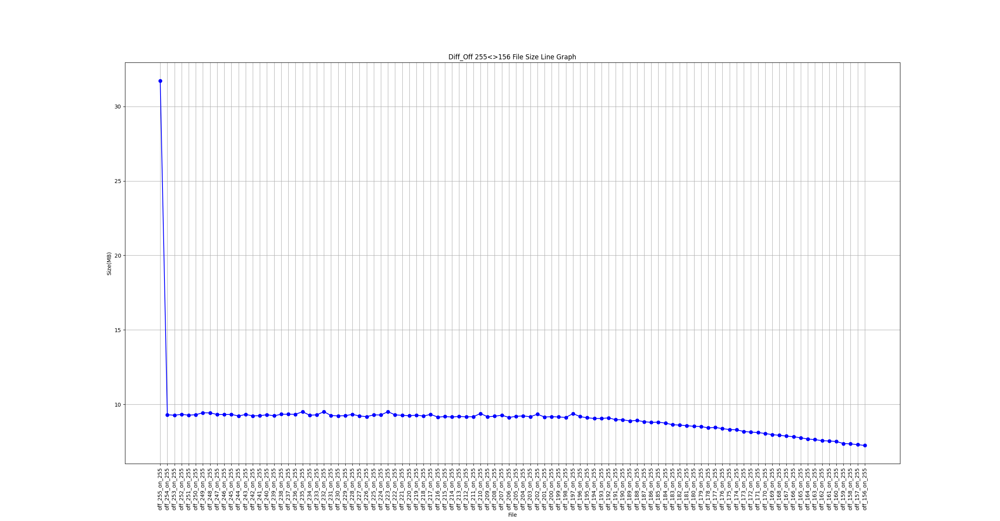
</p>
<p align="center">
  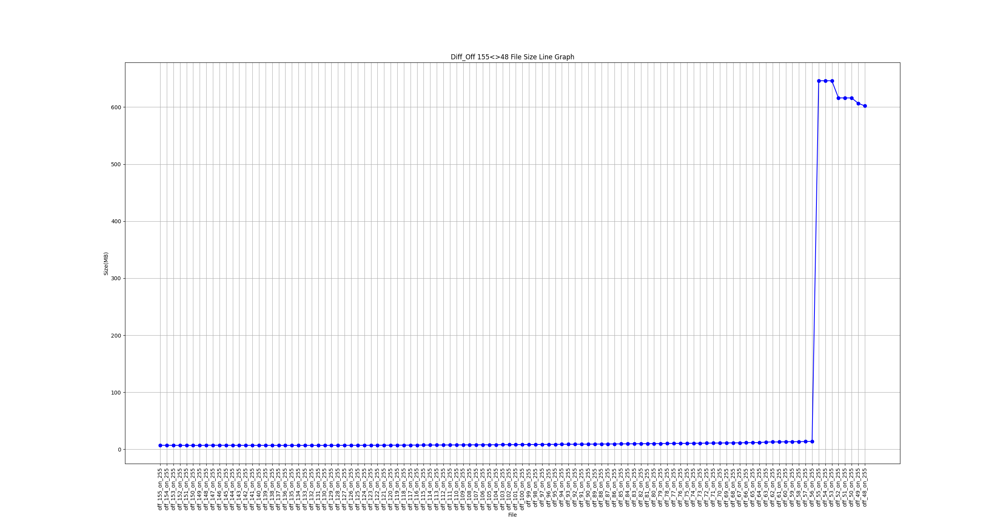
</p>

### Diff_on File size (MB) vs Bias
<p align="center">
  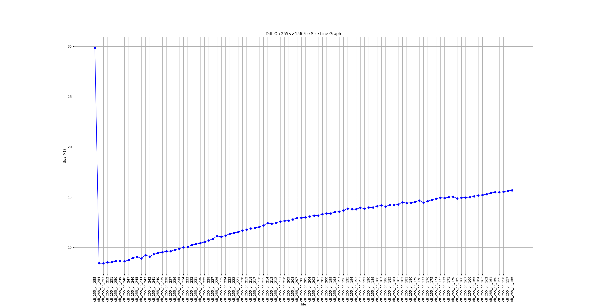
</p>
<p align="center">
  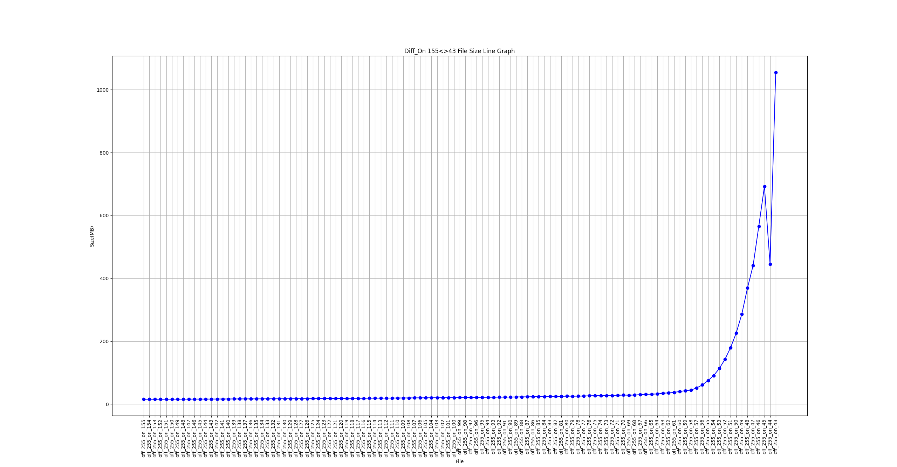
</p>

A hot pixel detector and filter were constructed to analyse the data in these recordings and provide the following results. Below is a section of untouched events from diff_off 55 after being processed. Immediately, attention is drawn to the upper right graph where a single line can be seen with 1.5 million off events, a hot pixel. This pixel also causes the sensor data array on the top left black, except for a single pixel. There is some rudimentary filtering in this section to remove the hot pixel, and the results are seen in the bottom plots. On the bottom right is the sensor data, filling each pixel with events. On the right is the filtered flattened plot, which still shows the off events to have more weight, which is expected with such a vast difference in the bias settings. 

<p align="center">
  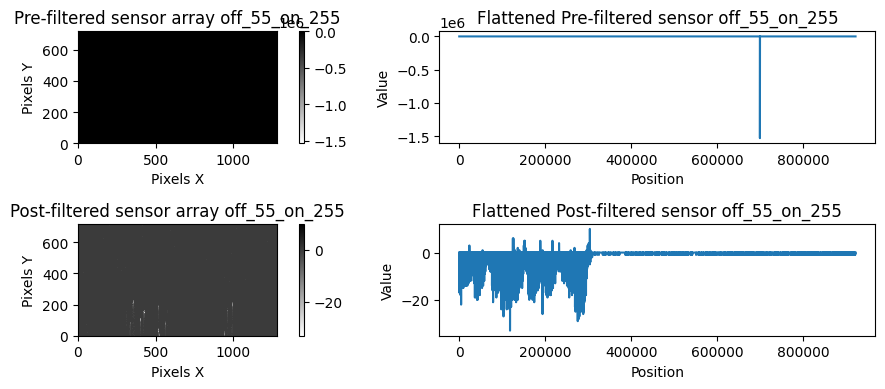
</p>

Below is the time surface for the unfiltered events. The single line seen is the hot pixel being shifted at each iteration when, in fact, it is on a single pixel and not moving separately to the camera.

<p align="center">
  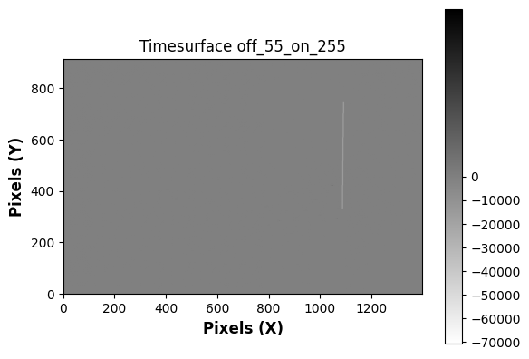
</p>

Filtering takes place using the code below, which initially samples the first 1000 events for more than one on a single pixel. These x and y locations are then removed from the CSV, and a second filtering segment runs, which accounts for the whole file. The second filter removes any pixel with more hits than the total number of events in the file multiplied by 0.005%.
The results from this filter are below:
```
29944689
     x    y  count
0  309  546    993
613538
```
The first line (29944689) is the amount of events in the unfiltered file. The second and third lines are the returned results of the first 1000 events check. The hot pixel was responsible for 993 out of the first 1000. Finally, the fourth line shows the remaining events after filtering. 

<p align="center">
  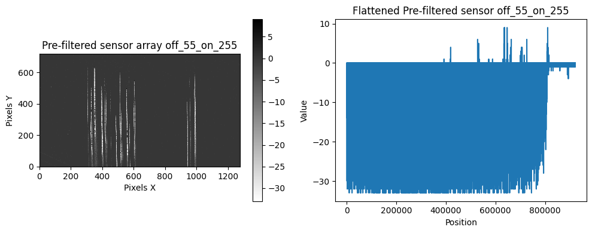
</p>

The plots above show the filtered event data on each pixel for the entire file. The new flattened event count is on the right, with no hot pixel detected. Below is the filtered time surface, which shows the stars in position. The on events are not as noticeable in this example as the Bias is set to 255.

<p align="center">
  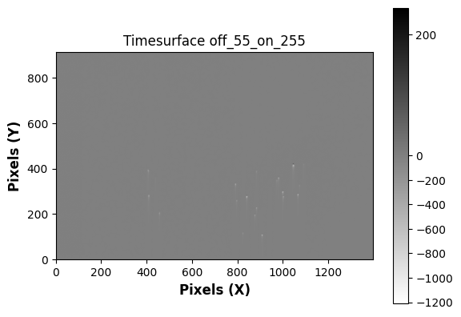
</p>


## Dataset
Attached below is a link to a dataset containing a complete set of on and off recordings in both CSV and ES form. Referencing this and the file size graphs should allow for predetermined Bias starting points when observing stars/satellites. Depending on the detail needed in the recording using the results above, a tuning on Bias until performance is achieved, then off can be tuned to any setting under the hot pixel threshold, which may vary by camera.

.ES and CSV files are available using the link. There are files for both Diff_On and Diff_Off in raw form and as a zipped file.

https://westernsydneyedu.sharepoint.com/:f:/r/sites/MoNE2022/Shared%20Documents/General/SimulatedStarRecordings?csf=1&web=1&e=SZCRum
